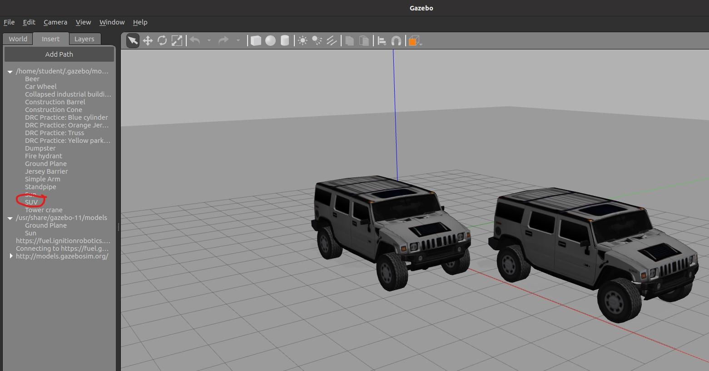
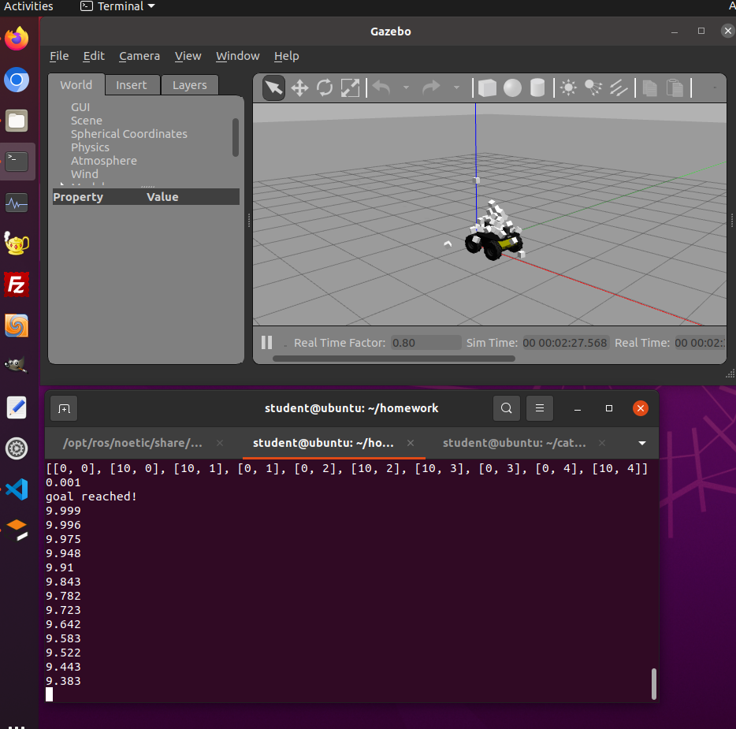

10.1

10.2

.png)

.png)

10.3:

.png)

I used the code zamboni.py (provided in repo) and snow.py (provided in repo) to make the husky move through "snow". Here are some screenshots:

Here are some ways we could make the husky move:
1. we could change the model state using             rosservice call /gazebo/set_model_state             from the terminal
2. we could publish twist commands to the topic /cmd_vel directly from the terminal
3. we could publish twist commands the /cmd_vel using a ROS node

11.1
I found it very interesting how the example provided in the tutorial allows real-time interaction between a ROS actionlib server and a web application.

11.2
I found it interesting to learn how ros parameters are set using roslibjs.

